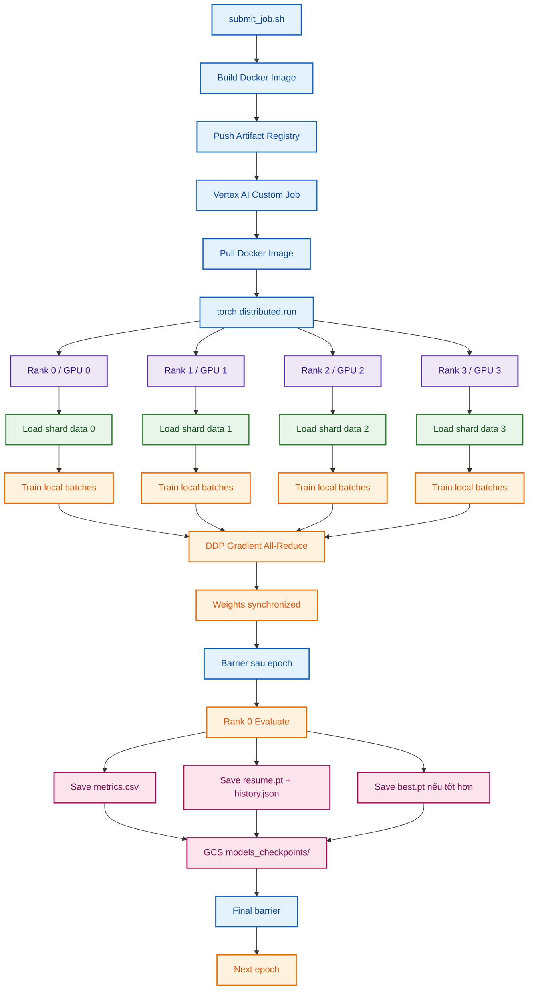
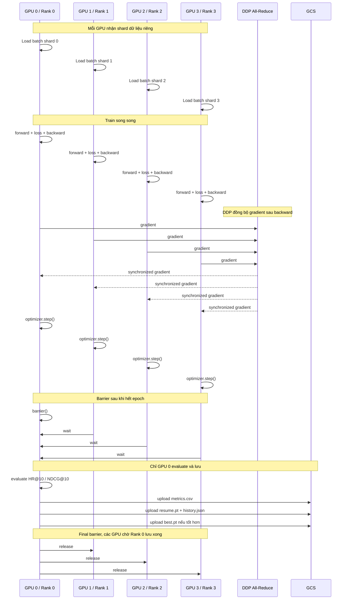
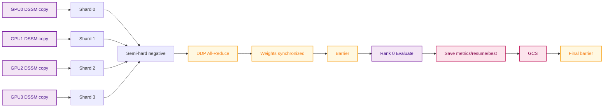
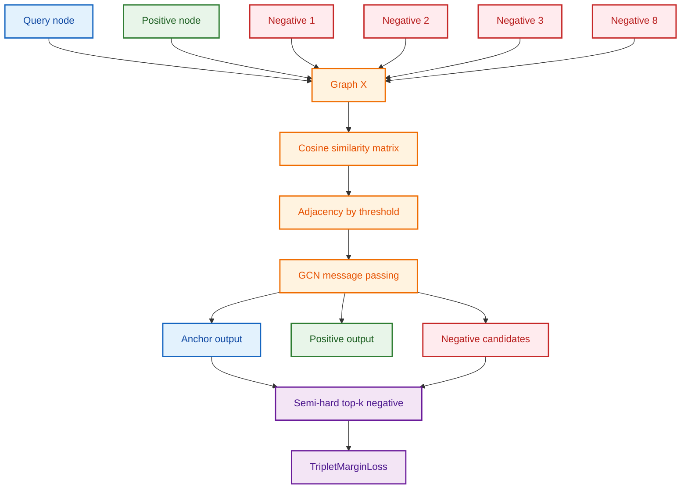

# Báo cáo Distributed Training cho DSSM và GCN trên Vertex AI

## 1. Tổng quan

Dự án huấn luyện hai baseline chính:

- **Baseline 3: DSSM / Two-Tower Retrieval**
- **Baseline 4: Batched GCN / Graph-based Retrieval**

Cả hai được chạy trên Vertex AI Custom Job với **1 VM, 4 GPU T4**, dùng **PyTorch DistributedDataParallel (DDP)**. Mỗi GPU nhận một shard dữ liệu riêng, train song song, đồng bộ gradient sau mỗi batch, sau đó Rank 0 đánh giá và lưu checkpoint/metrics lên GCS.

---

## 2. Distributed Training là gì?

Distributed training chia quá trình huấn luyện model ra nhiều GPU hoặc nhiều máy. Trong dự án của nhóm, em dùng dạng:

```text
Single-node multi-GPU distributed training
```

Tức là:

```text
dùng 1 VM Vertex AI
VM này có 4 GPU T4
4 process PyTorch
mỗi process điều khiển 1 GPU
```

Mỗi GPU có một bản copy model riêng trong VRAM. Tuy nhiên, nhờ DDP, sau mỗi lần `loss.backward()`, gradient được **all-reduce** và tổng hợp giữa các GPU. Sau code `optimizer.step()`, trọng số của model trên GPU 0, 1, 2, 3 được đồng bộ.

---

## 3. Sơ đồ tổng quan hệ thống




---

## 4. Luồng 4 GPU trong một epoch




---

## 5. DSSM Distributed Training

DSSM là mô hình two-tower:

```text
Amazon/query embedding -> Amazon tower -> vector 128D
VN/product embedding    -> VN tower     -> vector 128D
```

Sau đó tính similarity giữa query và product.

Trong pipeline mới:

- Mỗi GPU có một bản DSSM riêng.
- Mỗi rank nhận shard interaction riêng.
- Mỗi batch chỉ được đưa lên GPU khi train.
- Negative sampling dùng **semi-hard top-k in-batch negative**.
- DDP đồng bộ gradient sau mỗi batch.
- Rank 0 evaluate toàn bộ eval set.
- Rank 0 lưu `dssm_metrics.csv`, `dssm_resume.pt`, `dssm_history.json`, `dssm_best.pt`.



---

## 6. GCN Distributed Training

GCN dùng class `BatchedGCN` từ `models.py`. Model nhận:

```text
X: (B, N, 768)
```

và trả:

```text
X_out: (B, N, 128)
```

Ở phiên bản mới, mỗi sample không còn graph 2 node nữa. Mỗi graph gồm:

```text
query + positive + nhiều negative candidates
```

Ví dụ với `num_neg = 8`:

```text
N = 1 query + 1 positive + 8 negatives = 10 nodes
```

Điều này giúp GCN có **graph context thật**, vì các node trong cùng graph được kết nối bằng cosine similarity và adjacency threshold.



---

## 7. Vì sao chỉ GPU 0 evaluate?

Trong DDP, GPU 0, 1, 2, 3 đều có model copy riêng nhưng gradient được đồng bộ sau mỗi backward. Vì vậy sau mỗi optimizer step:

```text
model GPU0 ≈ model GPU1 ≈ model GPU2 ≈ model GPU3
```

Do đó, evaluate model trên GPU 0 là đủ. Nếu cả 4 GPU cùng evaluate toàn bộ eval set thì vừa tốn tài nguyên, vừa dễ bị tính trùng metrics.

---

## 8. Vì sao cần barrier?

Có hai barrier chính:

### Barrier sau train epoch

Đảm bảo tất cả GPU train xong epoch hiện tại trước khi Rank 0 evaluate.

### Barrier sau evaluate/save

Đảm bảo Rank 0 evaluate và upload checkpoint/metrics xong trước khi các GPU bước sang epoch tiếp theo.

đảm bảo được vì khi dùng Spot VM thì khi bị thu hồi, GCS vẫn có checkpoint gần nhất + history nên lần chạy sau sẽ bắt đầu từ epoch đang dở và train lại từ epoch đó với model đã lưu trọng số từ epoch trước.

---

## 9. Checkpoint và resume khi dùng Spot

Sau mỗi epoch, Rank 0 lưu:

| File | Ý nghĩa |
|---|---|
| `*_resume.pt` | model state, optimizer state, epoch gần nhất, best metric |
| `*_history.json` | lịch sử metric đã train |
| `*_metrics.csv` | bảng metric tổng hợp |
| `*_best.pt` | model tốt nhất theo HR@10 |

Khi job chạy lại:

```text
Rank 0 download resume checkpoint
barrier để các rank chờ
tất cả rank load cùng checkpoint
start_epoch = checkpoint_epoch + 1
train tiếp epoch kế tiếp
```

---

## 10. Đồng bộ loss distributed

Loss local của Rank 0 không đại diện toàn bộ 4 GPU. Vì vậy code mới all-reduce:

```text
loss_tensor = [total_loss, total_batches]
all_reduce SUM
global_avg_loss = total_loss_all_gpu / total_batches_all_gpu
```

`global_avg_loss` mới được ghi vào metrics CSV.

