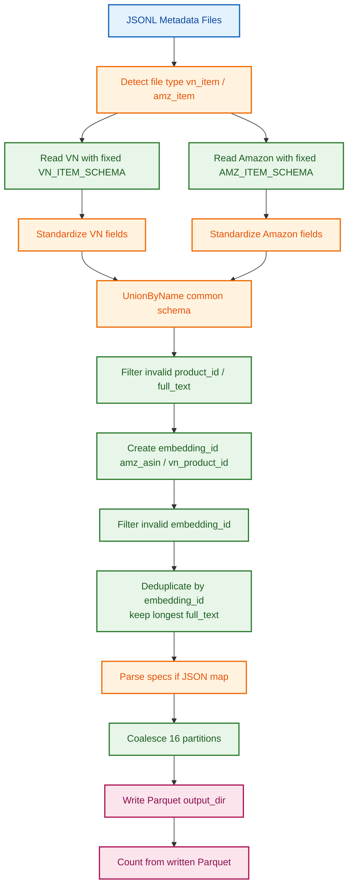
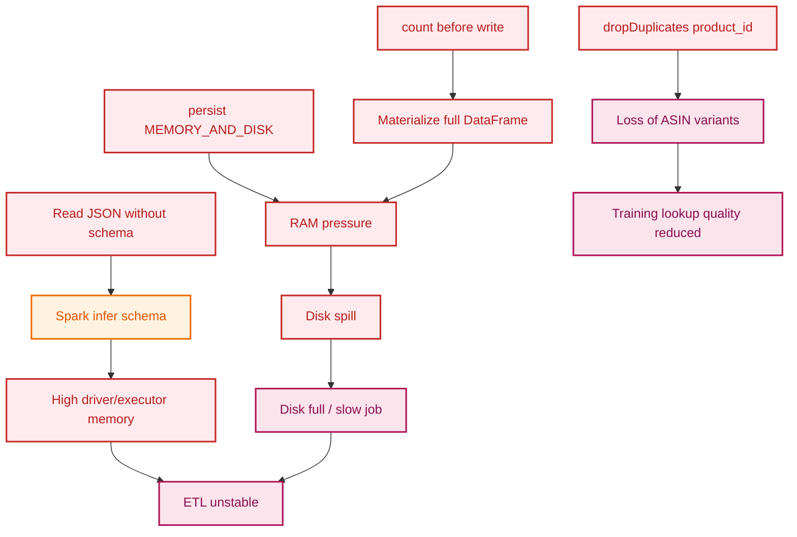
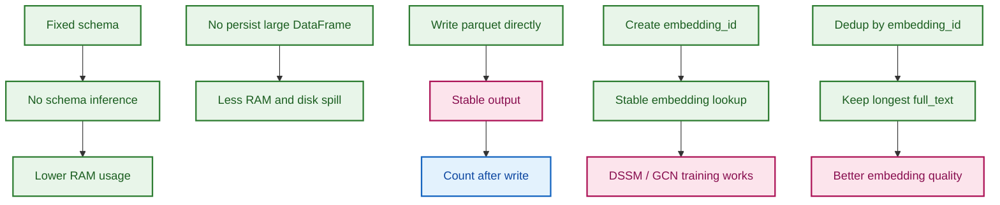

# Báo cáo so sánh ETL Item Nodes: bản cũ và bản V2 tối ưu

## 1. Mục tiêu của ETL Item Nodes

Module `etl_item_nodes` chuẩn hóa metadata sản phẩm từ Amazon và nguồn Việt Nam về cùng một schema để phục vụ:

- tạo `item_nodes` chuẩn hóa;
- tạo `embedding_id`;
- tạo `full_text` cho embedding;
- tạo `parsed_specs`;
- ghi dữ liệu ra Parquet cho các bước DSSM, GCN, Hybrid và LLM-CHGNN.

Schema đầu ra chính:

```text
product_id
asin
product_name
category
full_text
parsed_specs
domain
embedding_id
```

---

## 2. Vấn đề của bản ETL cũ

Bản cũ `etl_item_nodes.py` chạy được với dữ liệu nhỏ, nhưng dễ quá tải khi dữ liệu lớn.

Các vấn đề chính:

```text
RAM tăng cao
Disk spill nhiều
Spark job chậm hoặc fail
Nổ dữ liệu khi xử lý JSON lớn
```

### 2.1. Spark tự infer schema từ JSON lớn

Bản cũ đọc JSON như sau:

```python
df_vn = spark.read.option("mode", "DROPMALFORMED").json(vn_files)
df_amz = spark.read.option("mode", "DROPMALFORMED").json(amz_files)
```

Khi không truyền schema, Spark phải tự quét tập dữ liệu để tạo ra form mẫu dữ liệu. Với tập file JSONL lớn, nhiều field lồng nhau, array/map không đồng nhất, việc infer schema có thể rất lâu, tốn Ram, ...

Kết quả:

- tốn RAM của driver/executor;
- Spark phải scan nhiều dữ liệu trước khi xử lý;
- schema giữa các file có thể lệch;
- plan Spark phức tạp và dễ sập.

---

### 2.2. Thiết lập Persist MEMORY_AND_DISK làm tốn RAM/Disk

Bản cũ có đoạn:

```python
df_final = df_final.persist(StorageLevel.MEMORY_AND_DISK)
log_df_size(df_final, "df_final_items (Chuẩn bị ghi file)")
count = df_final.count()
df_final.write.mode("overwrite").parquet(output_dir)
df_final.unpersist()
```

Vấn đề:

- `persist(MEMORY_AND_DISK)` cố giữ DataFrame lớn trong RAM.
- Nếu RAM không đủ, Spark spill xuống disk.
- `count()` buộc Spark materialize toàn bộ DataFrame.
- Sau đó `write.parquet()` lại chạy thêm một action lớn.
- `log_df_size()` cũng có thể làm Spark phải duyệt dữ liệu.

Đây là nguyên nhân chính gây:

```text
RAM cao
Disk cao
job chậm
disk full
executor crash
```

---

### 2.3. Dedup theo product_id làm mất biến thể sản phẩm

Bản cũ:

```python
df_final = df_final.filter(col("product_id") != "").dropDuplicates(["product_id"])
```

Tập data Amazon, cột `product_id` thường lấy từ `parent_asin`. 1 `parent_asin` có nhiều `asin` product con. Loại bỏ row trùng lặp theo `product_id` sẽ làm mất các biến thể sản phẩm.

Nếu chỉ giữ một dòng theo `product_id`, các biến thể con bị loại, làm giảm khả năng khớp với sản phẩm VN.

---

### 2.4. Chưa có embedding_id chuẩn

Bản cũ chưa tạo khóa embedding dạng:

```text
amz_<asin>
vn_<product_id>
```

Điều này dễ gây:

- trùng ID giữa Amazon và VN;
- embedding không ổn định vì nhiều vector sẽ chung 1 id;
- khó chạy cho với precompute embedding;
- lỗi thiếu vector, vector có nhưng không có index trỏ đến để lấy khi train DSSM/GCN.

---

## 3. Bản ETL V2 đã cải tiến gì?

Code V2 `etl_item_nodes_v2.py` thay đổi theo hướng:

```text
Có thể khớp theo schema đã định nghĩa sẵn 
Không persist vào RAM/DISK DataFrame lớn
Không count trước khi write
Không loại bỏ trùng lặp theo id quá tay
Ghi Parquet trực tiếp
```

---

## 4. Sơ đồ tổng quan ETL V2




---

## 5. So sánh bản cũ và bản V2

| Hạng mục | Bản cũ | Bản V2 |
|---|---|---|
| Đọc JSON | Spark tự infer schema | Dùng schema cố định |
| Mode đọc | `DROPMALFORMED` | `PERMISSIVE` + schema chuẩn |
| Xử lý RAM | `persist(MEMORY_AND_DISK)` | Không persist DataFrame lớn |
| Đếm record | `count()` trước khi ghi | Ghi trước, count sau từ Parquet |
| Dedup | `dropDuplicates(["product_id"])` | Dedup theo `embedding_id`, giữ `full_text` dài nhất |
| Amazon ID | Chủ yếu `parent_asin` | Ưu tiên `asin > parent_asin > details["ASIN"]` |
| VN ID | `product_id`, `asin` riêng | `asin = coalesce(raw_asin, product_id)` |
| Embedding key | Chưa rõ ràng | `amz_<asin>` và `vn_<product_id>` |
| Ghi output | Partition mặc định | `coalesce(16).write.parquet()` |
| Rủi ro RAM/Disk | Cao | Thấp hơn nhiều |
| Phù hợp training | Dễ lệch key | Phù hợp precompute embedding + DSSM/GCN |

---

## 6. Phân tích các cải tiến chính trong V2

### 6.1. Dùng schema cố định thay vì infer schema

Bản V2 định nghĩa schema rõ ràng:

```python
VN_ITEM_SCHEMA = StructType([
    StructField("product_id", StringType(), True),
    StructField("asin", StringType(), True),
    StructField("product_name", StringType(), True),
    StructField("specifications", ArrayType(StringType()), True),
    StructField("description", StringType(), True),
    StructField("breadcrumb", StringType(), True)
])
```

```python
AMZ_ITEM_SCHEMA = StructType([
    StructField("parent_asin", StringType(), True),
    StructField("asin", StringType(), True),
    StructField("title", StringType(), True),
    StructField("features", ArrayType(StringType()), True),
    StructField("description", ArrayType(StringType()), True),
    StructField("main_category", StringType(), True),
    StructField("details", MapType(StringType(), StringType()), True)
])
```

Sau đó đọc bằng:

```python
df_vn = spark.read.option("mode", "PERMISSIVE").schema(VN_ITEM_SCHEMA).json(vn_files)
df_amz = spark.read.option("mode", "PERMISSIVE").schema(AMZ_ITEM_SCHEMA).json(amz_files)
```

Lợi ích:

- không infer schema;
- giảm scan dữ liệu dư;
- giảm memory pressure;
- ổn định hơn khi field bị thiếu;
- hạn chế lỗi array/string/map không đồng nhất.

---

### 6.2. Không persist DataFrame lớn

Bản V2 bỏ `persist(MEMORY_AND_DISK)` và ghi trực tiếp:

```python
df_final.coalesce(16).write.mode("overwrite").parquet(output_dir)
```

Sau đó mới count:

```python
final_count = spark.read.parquet(output_dir).count()
```

Lợi ích:

```text
Không giữ toàn bộ df_final trong RAM
Không ép Spark materialize sớm
Giảm disk spill
Giảm nguy cơ disk full
```

---

### 6.3. Tạo embedding_id chuẩn

Bản V2 tạo khóa embedding rõ ràng:

```python
df_final = df_final.withColumn(
    "embedding_id",
    when(col("domain") == "amazon", F.concat(lit("amz_"), col("asin")))
    .otherwise(F.concat(lit("vn_"), col("product_id")))
)
```

Sau đó lọc invalid key:

```python
df_final = df_final.filter(
    (col("embedding_id").isNotNull()) &
    (col("embedding_id") != "") &
    (~col("embedding_id").isin("amz_", "vn_"))
)
```

Ý nghĩa:

- tránh trùng key giữa Amazon và VN;
- khớp trực tiếp với precomputed embeddings;
- DSSM/GCN lookup bằng `amz_<asin>` và `vn_<product_id>`;
- giảm lỗi missing embedding khi train.

---

### 6.4. Dedup thông minh theo embedding_id

Bản V2:

```python
df_final = df_final.withColumn("text_len", F.length(col("full_text")))

w = Window.partitionBy("embedding_id").orderBy(F.desc("text_len"))

df_final = df_final.withColumn("rn", F.row_number().over(w)) \
                   .filter(col("rn") == 1) \
                   .drop("rn", "text_len")
```

Ý nghĩa:

```text
Nếu có nhiều dòng trùng embedding_id,
giữ dòng có full_text dài hơn.
```

Điều này giúp:

- không mất ASIN con;
- không giữ bản metadata quá ngắn;
- cải thiện chất lượng embedding;
- cải thiện matching downstream.

---

### 6.5. Ghi Parquet với số partition kiểm soát

Bản V2:

```python
df_final.coalesce(16).write.mode("overwrite").parquet(output_dir)
```

Tác dụng:

- tránh sinh quá nhiều small files;
- giảm overhead khi các bước sau đọc lại;
- output trên GCS gọn hơn;
- phù hợp pipeline downstream.

---

## 7. Sơ đồ nguyên nhân lỗi bản cũ



---

## 8. Sơ đồ cách V2 giải quyết



---

## 9. Code trọng tâm của bản V2

### 9.1. Đọc JSON với schema cố định

```python
df_vn = spark.read.option("mode", "PERMISSIVE") \
                  .schema(VN_ITEM_SCHEMA).json(vn_files)

df_amz = spark.read.option("mode", "PERMISSIVE") \
                   .schema(AMZ_ITEM_SCHEMA).json(amz_files)
```

---

### 9.2. Chuẩn hóa Amazon ID

```python
df_amz_std = df_amz.select(
    col("parent_asin").alias("raw_p_asin"),
    col("asin").alias("raw_a_asin"),
    col("title").alias("raw_title"),
    col("features").alias("raw_features"),
    col("description").alias("raw_desc"),
    col("details").alias("raw_details"),
    col("main_category").alias("raw_bc")
).withColumn(
    "details_asin",
    coalesce(col("raw_details")["ASIN"], col("raw_details")["asin"])
).withColumn(
    "final_asin",
    spark_standardize(coalesce(col("raw_a_asin"), col("raw_p_asin"), col("details_asin")))
)
```

---

### 9.3. Tạo embedding ID

```python
df_final = df_final.withColumn(
    "embedding_id",
    when(col("domain") == "amazon", F.concat(lit("amz_"), col("asin")))
    .otherwise(F.concat(lit("vn_"), col("product_id")))
)
```

---

### 9.4. Dedup theo embedding_id

```python
df_final = df_final.withColumn("text_len", F.length(col("full_text")))

w = Window.partitionBy("embedding_id").orderBy(F.desc("text_len"))

df_final = df_final.withColumn("rn", F.row_number().over(w)) \
                   .filter(col("rn") == 1) \
                   .drop("rn", "text_len")
```

---

### 9.5. Ghi Parquet tối ưu

```python
df_final.coalesce(16).write.mode("overwrite").parquet(output_dir)

final_count = spark.read.parquet(output_dir).count()
```

---

## 10. Kết luận

Bản ETL cũ bị quá tải chủ yếu do:

```text
Spark infer schema
persist MEMORY_AND_DISK
count trước khi write
dedup quá mạnh theo product_id
chưa có embedding_id chuẩn
```

Bản V2 giải quyết bằng:

```text
schema cố định
đọc PERMISSIVE
không persist DataFrame lớn
lọc dữ liệu trước khi ghi
tạo embedding_id chuẩn
dedup theo embedding_id giữ full_text dài nhất
ghi Parquet trực tiếp với coalesce(16)
count sau khi ghi
```

Nhờ đó, pipeline V2 ổn định hơn, giảm RAM, giảm Disk spill, tránh nổ dữ liệu và tạo output phù hợp hơn cho các bước embedding, DSSM, GCN và ranking phía sau.
